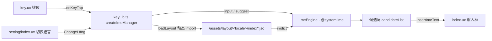

# Glyphix Board · 手表输入法

基于 **Glyphix UX 单文件组件 + TypeScript** 实现的智能手表输入法（IME）应用：多语言键盘布局、候选词联想、词库管理与语言切换。

| 项目 | 值 |
| --- | --- |
| 应用包名 | `com.xfaith.openboard` |
| 版本 | `0.3.0`（versionCode `30`） |
| 路由入口 | `launch` |
| 对外 scheme | `ime`（可被宿主应用通过 `ime://` 唤起） |
| 权限 | `watch.permission.RECORD`、`watch.permission.DEVICE_INFO` |
| 设计稿宽度 | `410` |

## 功能概览

| 模块 | 说明 |
| --- | --- |
| 授权页 `views/launch` | 隐私政策/许可确认，同意后写入 `internal://files/license` 与 `@system.storage` |
| 输入面板 `views/board/index.ux` | 垂直 `swiper`：上滑进入设置面板；顶栏候选词、输入框、密码显隐、确认回传（`@system.app.sendBroadcast`） |
| 键盘 `views/board/key.ux` | 按 `Store` 当前语言渲染 `components/layout/*.ux` 键位；中文 9 键 / 26 键、英文等 |
| 表情 `views/board/emoji.ux` | Emoji 面板（`showBoardType === 'emoji'`） |
| 数字符号 `views/board/numberSymbol.ux` | 数字与符号面板（`showBoardType === 'number'`） |
| 候选词 | `@system.ime` 查询与联想、候选列表展开、长按退格连删 |
| 语言与键盘选择 `views/setting/index.ux` | 网格展示表情/数字/各语言键盘与设置入口，切换后触发 `ChangeLang` |
| 设置/关于 `views/setting/setting.ux`、`about.ux` | 展示应用版本、git hash 与 IME 引擎版本 |

## 技术栈

- Glyphix UX 单文件组件（`template` / `script lang="ts"` / `style`）
- TypeScript 5，`strict` 模式，路径别名 `/*` → `src/*`
- `@system.*` 系统 API：`ime`、`router`、`file`、`storage`、`network`、`server`、`prompt`、`launch`、`app`、`device`、`brightness`、`invoke`
- `glyphix-utils`（^2.1.0）：`EventEmitter`（事件总线）、`TaskQueue`（词库加载串行队列）
- i18n：`src/i18n/*.json` + 模板内 `$t()`
- 构建期：`glyphix.config.ts` 注入版本宏并按日志等级裁剪 `console.*`

## 目录结构

```text
src/
├── app.ts                    应用生命周期（router / storage / brightness / server / invoke）
├── manifest.json             包名、权限、路由表（launch / board / setting / settings / about）、scheme
├── i18n/                     default(en) 与 zh-CN 文案
├── store/index.ts            语言与键盘列表状态，持久化到 internal://files/langs/info.json
├── utils/
│   ├── event.ts              事件总线与事件常量（全局唯一来源）
│   ├── container.ts          轻量 DI 容器（register / singleton / get）
│   ├── ime-engine.ts         ImeEngine 封装 @system.ime + 错误码 → i18n key 映射
│   ├── network.ts            网络状态监听
│   ├── prompt.ts             toast / popup 封装
│   ├── debounce.ts           防抖工具（带 cancel 与被取代 reject）
│   ├── tools.ts              formatTime 等零散工具
│   ├── constants.ts          存储 key 与目录常量
│   └── type.ts               ShowKeyBoardType 等枚举与候选词类型
├── types/                    Candidate、BoardItem 等业务类型与 @system.ime 声明
├── components/layout/        键盘布局组件（en-US、zh-CN/zh-HK/zh-TW 的 9 键与 26 键）+ common.css
├── assets/
│   ├── layout/<locale>/      随包发布的布局与词库产物：index*.jsc、<locale>.imdict、info.json
│   ├── imgs/                 键盘、语言、表情、图标等图片资源
│   └── fonts/                字体资源目录
└── views/
    ├── launch/index.ux       授权页
    ├── board/                index.ux 输入面板、key.ux 键盘、keyLib.ts 输入法逻辑、emoji / numberSymbol
    └── setting/              index.ux 语言/键盘选择、setting.ux 设置项、about.ux 关于
```

## 快速开始

前置要求：Node.js、包管理器（npm / yarn / pnpm，**避免使用 cnpm**）、Glyphix 工具链（`glyphix` ^1.2.9）。
VS Code 需安装 **glyphix** 插件，并**卸载 Vue 插件**（两者配置冲突）。

```bash
yarn install

# 模拟器运行
gx emu
# 指定设备运行 / 打包（产物位于 .glyphix-work/dist/<device>/<package>/）
gx emu -d <device>
gx build -d <device>
gx list device          # 查看可用设备
```

环境变量（`.env` / `.env.development` / `.env.production`，由工具链在构建时读取）：

| 变量 | 作用 |
| --- | --- |
| `GLYPHIX_ENV` | 构建环境标识（`development` / `production`） |
| `GLYPHIX_DEBUG` | 日志裁剪等级（`trace`/`debug`/`info`/`warn`/`error`）：移除低于该等级的 `console.*` 调用，未匹配则不裁剪 |
| `GLYPHIX_EMU_LAUNCHER` | 为 `true` 时，退出应用改为跳回启动器（模拟器调试用） |

## 构建配置与产物

`glyphix.config.ts` 在构建期做两件事：

- `define` 注入编译期宏：`GLYPHIX_APP_VERSION`（取自 `src/manifest.json` 的 `versionName`）、`GLYPHIX_APP_HASH`（`git rev-parse --short HEAD`）、`GLYPHIX_TEXT_VERSION`（当前分钟数，供调试标识）。
- `cleanConsolePlugin`：依据 `GLYPHIX_DEBUG` 计算需剔除的等级，用 Babel 解析并删除对应的 `console.*` 调用（表达式位置替换为 `void 0`），从而减小包体。

运行时由 `Store` 提供 `path` + `layoutFile`，`keyLib.ts` 通过动态 `import()` 加载 `.jsc` 布局，并把同目录的 `.imdict` 交给 `ImeEngine.load()`。`info.json` 中的 `layoutFile` 为 `/assets/layout/<locale>/...` 形式的绝对资源路径。

> 调整键位需要同时修改布局 `.jsc` 产物与 `src/components/layout/` 下的对应组件，两者签名需保持一致（`showShiftValue` 属性 + `keyTap` 事件）。

## 注意事项

- 入口 `launch` 会先检查 `internal://files/license`，未同意许可时会 `SysRoute.replace({ uri: 'launch' })`，因此**首次运行必须完成授权**才会进入键盘页。
- `app.ts` 会调用 `SysServer.start()` 与 `keepAlwaysOn` / `setKeepScreenOn`，模拟器与真机上的屏幕常亮行为可能不同。
- `dist/`、`logs/`、`prof/`、`.glyphix-work/` 为本地打包与调试产物，已在 `.gitignore` 中忽略，不要提交。

## 架构要点



- **事件总线**：跨页面/组件通信统一走 `utils/event.ts` 的 `eventEmitter`，事件常量集中定义：`ChangeLang`、`ChangeBoardType`、`ChangeCandidateList`、`InsertImeText`、`ChangeShowBoardList`、`DownloadLibrary`。新增事件必须同步补到 `EventEmitter` 的类型映射里。
- **DI 容器**：`container.singleton('store' | 'imeEngine' | 'net', ...)` 注册，组件内用 `container.get<T>(key)` 取用，避免模块级循环依赖（`container.ts` 仅支持构造函数注入，构造参数为依赖 key 数组）。
- **输入法逻辑**：`views/board/keyLib.ts` 的 `createImeManager(ctx, container)` 以闭包持有候选词、原始按键序列 `rawInputGroup`、光标文本 `displayInputText`、长按退格定时器等状态，并用 `TaskQueue` 保证布局/词库加载串行（`_queryImeRunning` / `_queryImePending` 防止并发查询）；`key.ux` 只负责渲染与事件转发。
- **词库与引擎**：`ImeEngine.load({ path, maxCandidates: 16, maxSyllables: 4 })` → `selectMethod(boardMask)` → `input(line)` / `suggest(candidate)`；错误码经 `normalizeImeError` + `getImeErrorI18nKey` 映射为 `$t()` 文案（`imeStatus*` 系列）。
- **持久化**：语言列表与激活项写入 `internal://files/langs/info.json`（`Store.saveLangInfo`）；许可状态写入 `internal://files/license` 与 `@system.storage` 的 `user.resolve.license`。
- **依赖注意**：`TaskQueue` 采用子路径导入 `glyphix-utils/modules/queue`，该子路径仅在 `glyphix-utils` **2.x** 的 `exports` 中声明（`./modules/*`）；降级到 1.x 会报 “not exported by package”，此时需改为从包根导入（`import { TaskQueue } from 'glyphix-utils'`）。

## 代码规范

### ux 文件规范

ux 文件中的 `script` 标签中声明 `lang="ts"` 属性， 默认导出使用的对象 `glyphix` 包中的 `defineComponent` 方法进行包裹； 响应式属性 `data` 尽可能添加类型声明， 方便后续在方法中访问和减少不必要的错误
参考以下示例

```html
<script lang="ts">
  import { defineComponent } from 'glyphix';
  interface Data {
    name: string;
    age: number;
  }
  export default defineComponent({
    data: {
      name: '',
      age: 0,
    },
  });
</script>
```

### 其他代码规范

- 代码中日志输出使用 `console.debug` `console.info` `console.warn` `console.error` 四种日志等级的方式，避免直接使用 `console.log`， 代码校验对 `console.log` 会抛出异常，拒绝构建和提交代码
- 项目已配置好自动格式化代码
- **在 `ux` 和 `ts` 文件中引入其他 `ts` 模块时，禁止使用相对路径，同一目录除外， 否则在构建时可能会增加包体积以及导致其他代码逻辑错误** （构建校验：`eslint` 的 `no-restricted-imports` 已禁止 `../*`）
- 运行时不具备浏览器环境：禁止使用 DOM / `window` / `document` / `localStorage` 等 Web API，需使用对应的 `@system.*` 能力
- 代码提交前由 `husky` + `lint-staged` 自动执行 `eslint --fix`，并遵循 `commitlint` 校验

## 提交规范

- commit message 遵循 [约定式提交 1.0.0](https://www.conventionalcommits.org/zh-hans/v1.0.0/)，由 `commitlint`（`@commitlint/config-conventional`）在 `commit-msg` 钩子校验。
- `pre-commit` 钩子通过 `lint-staged` 对暂存的 `**/*.{ts,tsx,js,jsx}` 执行 `eslint --fix`。
- 推荐格式 `type(scope): subject`，scope 取模块名（如 `board`、`setting`、`store`）。
